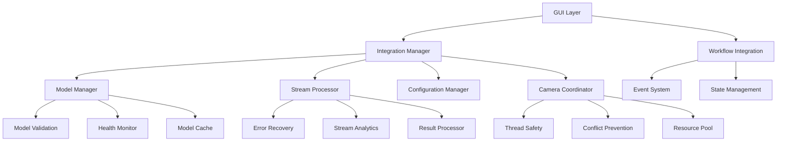
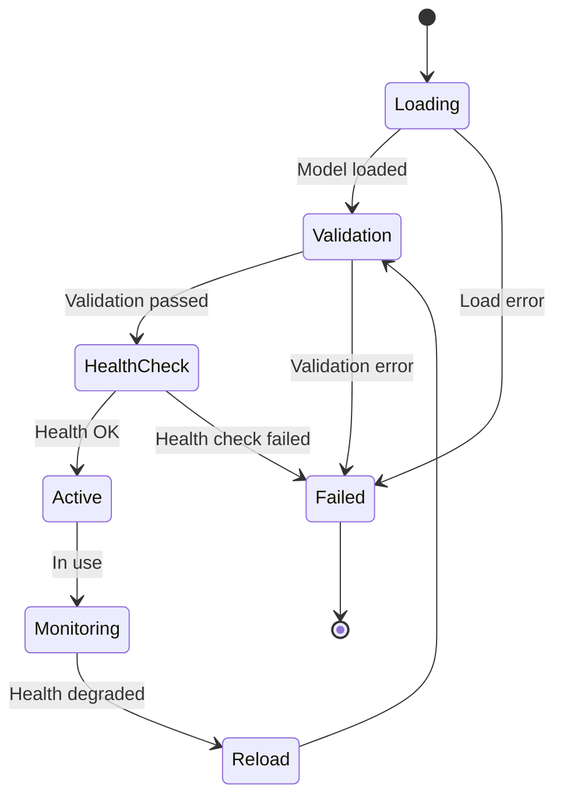
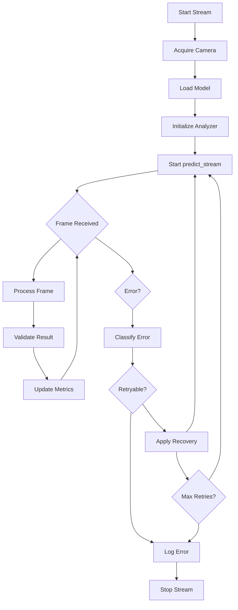
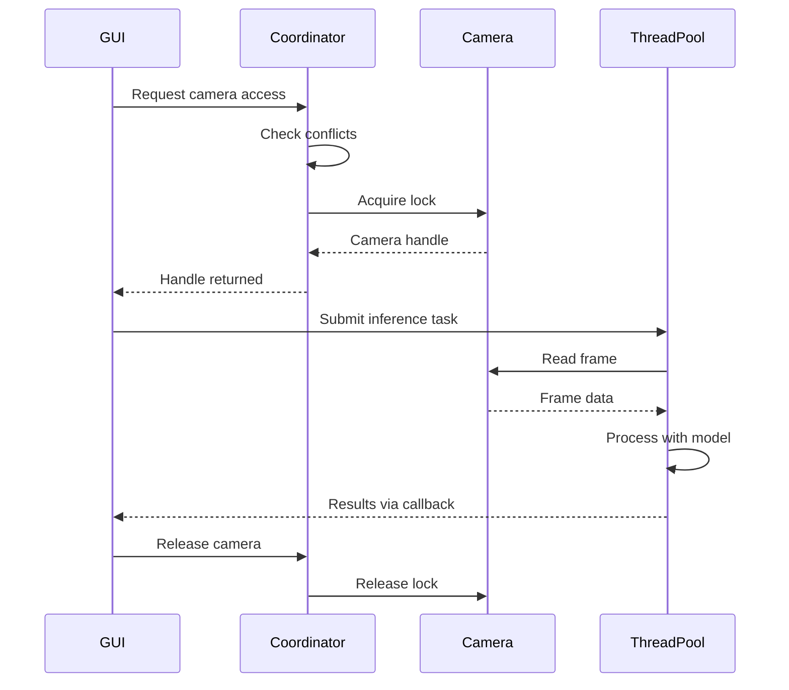
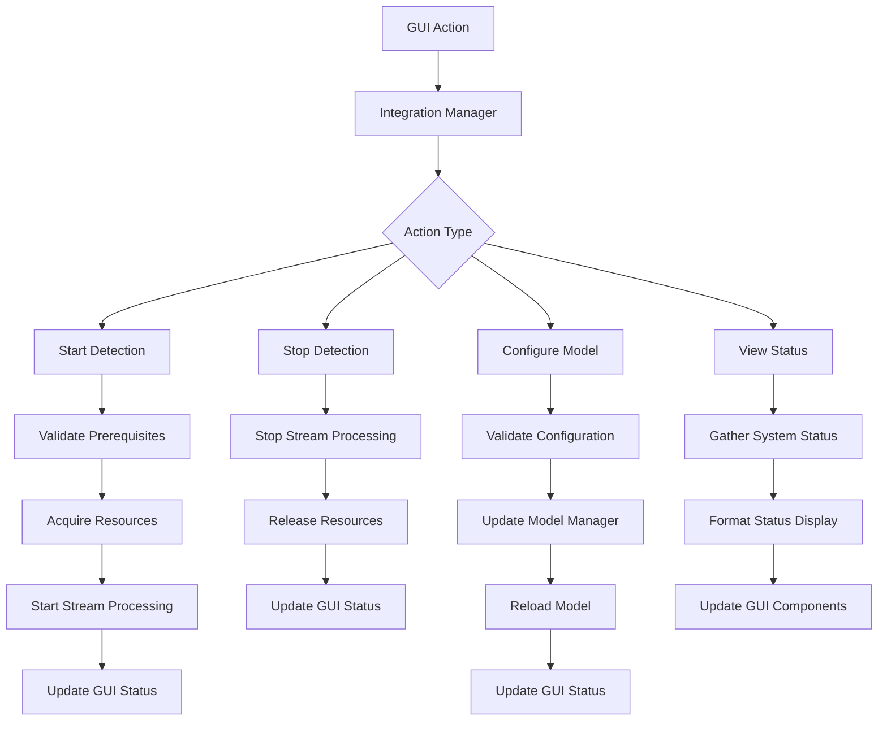

# Improved Degirum Integration Architecture - Technical Specification

## Executive Summary

This document outlines a comprehensive redesign of the Degirum integration for the InspecturaGUI project, addressing critical issues in model loading, error handling, configuration management, and system robustness. The improved architecture provides robust model management, enhanced predict_stream functionality, and seamless integration with existing GUI and workflow systems.

## Current System Analysis

### Identified Issues
1. **Model Loading Failures**: HEF file loading attempts fail with fallback to mock models
2. **Limited Error Recovery**: No robust error handling in predict_stream operations
3. **Hardcoded Configuration**: Model paths and settings are hardcoded in source code
4. **No Health Monitoring**: Lack of model performance and health tracking
5. **Camera Conflicts**: Potential conflicts when multiple threads access cameras simultaneously
6. **Testing Gaps**: Limited automated testing for Degirum integration

### Existing Infrastructure
- **Error Handling**: Comprehensive logging and modal notification system
- **Camera Management**: Thread-safe camera access with reconnection logic
- **Configuration**: Basic settings management system
- **Threading**: Background monitoring and processing threads

## Architecture Overview



## 1. Model Management System

### Core Components

#### ModelManager Class
```python
class ModelManager:
    def __init__(self, config_manager):
        self.config = config_manager
        self.models = {}
        self.health_monitor = ModelHealthMonitor()
        self.validator = ModelValidator()

    def load_model(self, model_name: str, model_type: str = 'defect') -> Optional[object]:
        """Load model with validation and health checks"""

    def validate_model(self, model, test_data=None) -> ValidationResult:
        """Validate model functionality and performance"""

    def get_model_health(self, model_name: str) -> HealthStatus:
        """Get current health status of model"""

    def reload_model(self, model_name: str) -> bool:
        """Reload model with error recovery"""
```

#### ModelHealthMonitor Class
```python
class ModelHealthMonitor:
    def __init__(self):
        self.metrics = {}
        self.thresholds = {
            'inference_time': 1000,  # ms
            'error_rate': 0.05,      # 5%
            'memory_usage': 1024,    # MB
        }

    def track_inference(self, model_name: str, inference_time: float, success: bool):
        """Track inference performance metrics"""

    def check_health(self, model_name: str) -> HealthStatus:
        """Check model health against thresholds"""

    def get_performance_report(self, model_name: str) -> Dict:
        """Generate performance report"""
```

#### ModelValidator Class
```python
class ModelValidator:
    def __init__(self):
        self.test_cases = self.load_test_cases()

    def validate_inference(self, model, test_input) -> ValidationResult:
        """Validate model inference capabilities"""

    def validate_output_format(self, result) -> bool:
        """Validate model output format"""

    def benchmark_performance(self, model, iterations: int = 100) -> BenchmarkResult:
        """Benchmark model performance"""
```

### Model Loading Workflow



## 2. Enhanced predict_stream with Error Recovery

### StreamProcessor Class
```python
class StreamProcessor:
    def __init__(self, model_manager, camera_coordinator, error_handler):
        self.model_manager = model_manager
        self.camera_coordinator = camera_coordinator
        self.error_handler = error_handler
        self.recovery_strategies = {
            'retry': RetryStrategy(),
            'fallback': FallbackStrategy(),
            'circuit_breaker': CircuitBreakerStrategy()
        }

    def process_stream(self, camera_name: str, model_name: str,
                      analyzer: ResultAnalyzerBase) -> StreamResult:
        """Process video stream with comprehensive error recovery"""

    def handle_stream_error(self, error: Exception, context: Dict) -> RecoveryAction:
        """Handle stream processing errors with appropriate recovery"""

    def validate_stream_result(self, result) -> ValidationResult:
        """Validate stream processing results"""
```

### Error Recovery Strategies

#### RetryStrategy
```python
class RetryStrategy:
    def __init__(self, max_retries: int = 3, backoff_factor: float = 1.5):
        self.max_retries = max_retries
        self.backoff_factor = backoff_factor

    def execute_with_retry(self, operation: Callable, *args, **kwargs) -> Any:
        """Execute operation with exponential backoff retry"""
```

#### CircuitBreakerStrategy
```python
class CircuitBreakerStrategy:
    def __init__(self, failure_threshold: int = 5, recovery_timeout: int = 60):
        self.failure_threshold = failure_threshold
        self.recovery_timeout = recovery_timeout
        self.failure_count = 0
        self.last_failure_time = None
        self.state = 'CLOSED'  # CLOSED, OPEN, HALF_OPEN

    def call(self, operation: Callable, *args, **kwargs) -> Any:
        """Execute operation with circuit breaker pattern"""
```

### Stream Processing Workflow



## 3. Configuration System

### ConfigurationManager Class
```python
class ConfigurationManager:
    def __init__(self, config_file: str = 'config/degirum_config.json'):
        self.config_file = config_file
        self.config = self.load_config()
        self.validator = ConfigValidator()

    def get_model_config(self, model_name: str) -> Dict:
        """Get configuration for specific model"""

    def update_model_config(self, model_name: str, updates: Dict) -> bool:
        """Update model configuration with validation"""

    def get_inference_config(self, camera_name: str) -> Dict:
        """Get inference configuration for camera"""

    def validate_config(self, config: Dict) -> ValidationResult:
        """Validate configuration against schema"""
```

### Configuration Schema
```json
{
  "models": {
    "defect_detector": {
      "type": "defect",
      "path": "/models/UpdatedDefects--640x640_quant_hailort_hailo8_1.hef",
      "zoo_url": "/models/UpdatedDefects--640x640_quant_hailort_hailo8_1",
      "model_name": "UpdatedDefects--640x640_quant_hailort_hailo8_1",
      "confidence_threshold": 0.5,
      "input_shape": [640, 640, 3],
      "health_check_interval": 300
    }
  },
  "inference": {
    "fps": 30,
    "batch_size": 1,
    "timeout": 5000,
    "retry_attempts": 3
  },
  "cameras": {
    "top": {
      "index": 0,
      "resolution": [1920, 1080],
      "fps": 30
    },
    "bottom": {
      "index": 2,
      "resolution": [1920, 1080],
      "fps": 30
    }
  }
}
```

## 4. Improved Camera and Thread Management

### CameraCoordinator Class
```python
class CameraCoordinator:
    def __init__(self, camera_configs: Dict):
        self.cameras = {}
        self.locks = {}
        self.usage_tracker = CameraUsageTracker()
        self.initialize_cameras(camera_configs)

    def acquire_camera(self, camera_name: str, requester: str) -> CameraHandle:
        """Acquire camera with conflict prevention"""

    def release_camera(self, handle: CameraHandle):
        """Release camera handle"""

    def get_camera_status(self, camera_name: str) -> CameraStatus:
        """Get current camera status"""

    def prevent_conflicts(self, camera_name: str, operation: str) -> bool:
        """Check and prevent camera access conflicts"""
```

### Thread Management
```python
class ThreadManager:
    def __init__(self, max_threads: int = 4):
        self.executor = ThreadPoolExecutor(max_workers=max_threads)
        self.active_tasks = {}
        self.task_monitor = TaskMonitor()

    def submit_inference_task(self, camera_name: str, model_name: str,
                            callback: Callable) -> Future:
        """Submit inference task to thread pool"""

    def monitor_task_health(self, task_id: str) -> TaskStatus:
        """Monitor task execution health"""

    def cancel_task(self, task_id: str) -> bool:
        """Cancel running task"""
```

### Camera Access Pattern



## 5. Integration Points with GUI and Workflow

### IntegrationManager Class
```python
class IntegrationManager:
    def __init__(self, gui_interface, workflow_manager):
        self.gui = gui_interface
        self.workflow = workflow_manager
        self.model_manager = ModelManager(self.config_manager)
        self.stream_processor = StreamProcessor(...)
        self.event_system = EventSystem()

    def start_detection_workflow(self, camera_name: str) -> WorkflowHandle:
        """Start detection workflow for camera"""

    def handle_detection_results(self, results: Dict, workflow_handle: WorkflowHandle):
        """Handle detection results and update GUI"""

    def handle_system_errors(self, error: Exception, context: Dict):
        """Handle system errors with GUI feedback"""

    def update_gui_status(self, status: Dict):
        """Update GUI with system status"""
```

### Event System
```python
class EventSystem:
    def __init__(self):
        self.listeners = defaultdict(list)
        self.event_queue = Queue()

    def emit_event(self, event_type: str, data: Dict):
        """Emit event to registered listeners"""

    def register_listener(self, event_type: str, callback: Callable):
        """Register event listener"""

    def process_events(self):
        """Process queued events"""
```

### GUI Integration Workflow



## Implementation Approach

### Phase 1: Core Infrastructure
1. Implement ModelManager with validation and health monitoring
2. Create ConfigurationManager with JSON schema validation
3. Develop CameraCoordinator with conflict prevention
4. Build ThreadManager with task monitoring

### Phase 2: Stream Processing
1. Implement StreamProcessor with error recovery strategies
2. Integrate predict_stream with comprehensive error handling
3. Add result validation and analytics
4. Implement circuit breaker pattern

### Phase 3: Integration and Testing
1. Create IntegrationManager for GUI/workflow integration
2. Implement event system for loose coupling
3. Develop comprehensive test suite
4. Add monitoring and alerting

### Phase 4: Deployment and Optimization
1. Performance optimization and benchmarking
2. Memory management improvements
3. Production deployment procedures
4. Documentation and training

## Testing Strategy

### Unit Testing
- ModelManager validation and health checks
- ConfigurationManager schema validation
- CameraCoordinator conflict prevention
- StreamProcessor error recovery

### Integration Testing
- End-to-end detection workflow
- GUI integration scenarios
- Multi-camera concurrent access
- Error condition handling

### Performance Testing
- Inference throughput benchmarking
- Memory usage monitoring
- Thread contention analysis
- Recovery time measurement

### Automated Test Suite
```python
class DegirumIntegrationTestSuite:
    def test_model_loading_and_validation(self):
        """Test model loading with various file formats"""

    def test_predict_stream_error_recovery(self):
        """Test stream processing with simulated errors"""

    def test_camera_conflict_prevention(self):
        """Test concurrent camera access prevention"""

    def test_configuration_validation(self):
        """Test configuration schema validation"""

    def test_gui_integration_workflow(self):
        """Test complete GUI integration workflow"""
```

## Risk Mitigation

### Technical Risks
1. **Model Loading Failures**: Implement fallback mechanisms and validation
2. **Memory Leaks**: Add resource monitoring and cleanup procedures
3. **Thread Deadlocks**: Implement timeout mechanisms and deadlock detection
4. **Performance Degradation**: Add performance monitoring and optimization

### Operational Risks
1. **Configuration Errors**: Schema validation and automated testing
2. **System Instability**: Circuit breaker patterns and graceful degradation
3. **Data Loss**: Comprehensive logging and error recovery
4. **User Experience**: Modal notifications and clear error messaging

## Success Metrics

### Performance Metrics
- Model loading time < 5 seconds
- Inference latency < 100ms per frame
- Memory usage < 2GB during normal operation
- Error recovery time < 30 seconds

### Reliability Metrics
- System uptime > 99.5%
- Successful inference rate > 95%
- Configuration validation success rate > 99%
- Camera reconnection success rate > 90%

### Quality Metrics
- Test coverage > 85%
- Code quality score > 8/10
- Documentation completeness > 90%
- User satisfaction score > 4/5

## Conclusion

This improved Degirum integration architecture addresses all identified issues while maintaining compatibility with existing systems. The modular design allows for incremental implementation and provides robust error handling, comprehensive monitoring, and seamless GUI integration. The implementation will significantly improve system reliability, maintainability, and user experience.