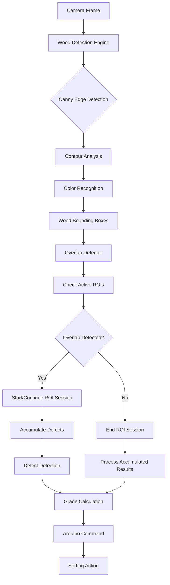

# ROI-Based Wood Detection and Grading System - Technical Specification

## Executive Summary

This document outlines the comprehensive redesign of the wood sorting system to replace the IR beam trigger with an ROI-based wood detection system. The new system will use computer vision algorithms to detect wood presence, define regions of interest, and trigger defect detection and grading workflows based on wood-ROI overlap detection.

## Current System Analysis

### Existing IR-Based Workflow
- **Trigger Mechanism**: Arduino IR sensor detects beam break/clear events
- **Detection Flow**: IR break (`B`) → start predict_stream, IR clear (`L:[ms]`) → stop and grade
- **Detection Focus**: Full-frame defect detection using Degirum HEF models
- **Grading**: SS-EN 1611-1 standard with Arduino command translation
- **Integration**: PyQt5 GUI, camera management, Arduino communication

### Current Architecture Components
- **DetectionModule**: Model management, camera coordination, stream processing
- **CameraModule**: Camera connection management and frame capture
- **GUIModule**: Live feeds, controls, defect analysis display
- **ArduinoModule**: Serial communication and command queuing
- **GradingModule**: Defect-to-grade conversion and Arduino command mapping

## New ROI-Based System Architecture

### Core Components

#### 1. ROI Management System
```python
class ROIManager:
    def __init__(self, config_manager):
        self.rois = {}  # Dictionary of ROI definitions
        self.active_rois = set()  # Currently active ROIs
        self.roi_states = {}  # Track ROI status and overlap

    def define_roi(self, camera_name: str, roi_id: str, coordinates: Dict) -> bool:
        """Define a new ROI for a camera feed"""

    def activate_roi(self, camera_name: str, roi_id: str) -> bool:
        """Activate an ROI for detection"""

    def deactivate_roi(self, camera_name: str, roi_id: str) -> bool:
        """Deactivate an ROI"""

    def check_overlap(self, bbox: Tuple, camera_name: str) -> List[str]:
        """Check which ROIs a bounding box overlaps with"""
```

#### 2. Wood Detection Engine
```python
class WoodDetectionEngine:
    def __init__(self, config_manager):
        self.canny_detector = CannyEdgeDetector()
        self.color_recognizer = ColorRecognitionEngine()
        self.contour_analyzer = ContourAnalyzer()

    def detect_wood(self, frame: np.ndarray) -> List[WoodDetection]:
        """Main wood detection pipeline"""

    def apply_canny_detection(self, frame: np.ndarray) -> np.ndarray:
        """Apply Canny edge detection for wood boundary detection"""

    def analyze_color_features(self, frame: np.ndarray, mask: np.ndarray) -> Dict:
        """Analyze color features for wood type recognition"""

    def extract_contours(self, edges: np.ndarray) -> List[Contour]:
        """Extract and filter contours for wood objects"""
```

#### 3. Overlap Detection System
```python
class OverlapDetector:
    def __init__(self, roi_manager: ROIManager):
        self.roi_manager = roi_manager
        self.overlap_history = {}  # Track overlap events over time

    def detect_overlaps(self, wood_detections: List[WoodDetection],
                       camera_name: str) -> Dict[str, List[str]]:
        """Detect overlaps between wood detections and active ROIs"""

    def calculate_overlap_percentage(self, bbox1: Tuple, bbox2: Tuple) -> float:
        """Calculate percentage overlap between two bounding boxes"""

    def track_overlap_events(self, overlaps: Dict) -> Dict:
        """Track overlap events for workflow triggering"""
```

#### 4. ROI-Based Workflow Manager
```python
class ROIBasedWorkflowManager:
    def __init__(self, detection_module, grading_module, arduino_module):
        self.detection_module = detection_module
        self.grading_module = grading_module
        self.arduino_module = arduino_module
        self.active_sessions = {}  # Track active detection sessions per ROI

    def start_roi_session(self, camera_name: str, roi_id: str) -> str:
        """Start a detection session when wood enters ROI"""

    def accumulate_defects(self, session_id: str, defects: Dict) -> None:
        """Accumulate defects during ROI overlap period"""

    def end_roi_session(self, session_id: str) -> Dict:
        """End session and return accumulated results for grading"""

    def trigger_grading_workflow(self, session_results: Dict) -> None:
        """Trigger grading and sorting based on accumulated defects"""
```

### Detection Pipeline Flow



## Implementation Components

### 1. ROI Definition System

#### ROI Configuration Schema
```json
{
  "rois": {
    "top_camera": {
      "inspection_zone": {
        "coordinates": [64, 0, 1216, 108],
        "active": true,
        "name": "Top Inspection Zone",
        "overlap_threshold": 0.3
      },
      "secondary_zone": {
        "coordinates": [200, 200, 1000, 400],
        "active": false,
        "name": "Secondary Inspection",
        "overlap_threshold": 0.5
      }
    },
    "bottom_camera": {
      "inspection_zone": {
        "coordinates": [64, 612, 1216, 720],
        "active": true,
        "name": "Bottom Inspection Zone",
        "overlap_threshold": 0.3
      }
    }
  },
  "wood_detection": {
    "canny_thresholds": [50, 150],
    "min_contour_area": 1000,
    "color_ranges": {
      "wood_brown": [[10, 50, 50], [30, 255, 255]],
      "wood_red": [[0, 50, 50], [10, 255, 255]]
    },
    "confidence_threshold": 0.6
  }
}
```

#### ROI Management Interface
- **Interactive ROI Definition**: Click and drag to define ROIs on camera feeds
- **ROI Persistence**: Save/load ROI configurations
- **ROI Visualization**: Real-time overlay of active ROIs
- **ROI Status Monitoring**: Active/inactive status with visual indicators

### 2. Wood Detection Algorithms

#### Canny Edge Detection Implementation
```python
class CannyEdgeDetector:
    def __init__(self, config):
        self.lower_threshold = config.get('lower_threshold', 50)
        self.upper_threshold = config.get('upper_threshold', 150)
        self.aperture_size = config.get('aperture_size', 3)

    def detect_edges(self, frame: np.ndarray) -> np.ndarray:
        """Apply Canny edge detection optimized for wood detection"""
        # Convert to grayscale
        gray = cv2.cvtColor(frame, cv2.COLOR_BGR2GRAY)

        # Apply Gaussian blur to reduce noise
        blurred = cv2.GaussianBlur(gray, (5, 5), 0)

        # Apply Canny edge detection
        edges = cv2.Canny(blurred, self.lower_threshold, self.upper_threshold,
                         apertureSize=self.aperture_size)

        return edges
```

#### Color Recognition Engine
```python
class ColorRecognitionEngine:
    def __init__(self, config):
        self.color_ranges = config.get('color_ranges', {})
        self.hsv_ranges = {}

        # Convert RGB to HSV ranges
        for color_name, rgb_range in self.color_ranges.items():
            self.hsv_ranges[color_name] = [
                np.array(rgb_range[0]),  # Lower bound
                np.array(rgb_range[1])   # Upper bound
            ]

    def recognize_wood_color(self, frame: np.ndarray, mask: np.ndarray) -> Dict:
        """Analyze color features within masked region"""
        # Convert to HSV color space
        hsv = cv2.cvtColor(frame, cv2.COLOR_BGR2HSV)

        results = {}
        for color_name, (lower, upper) in self.hsv_ranges.items():
            # Create color mask
            color_mask = cv2.inRange(hsv, lower, upper)

            # Apply region mask
            combined_mask = cv2.bitwise_and(color_mask, mask)

            # Calculate color coverage
            color_pixels = cv2.countNonZero(combined_mask)
            total_pixels = cv2.countNonZero(mask)

            if total_pixels > 0:
                coverage = color_pixels / total_pixels
                results[color_name] = coverage

        return results
```

#### Contour Analysis
```python
class ContourAnalyzer:
    def __init__(self, config):
        self.min_area = config.get('min_contour_area', 1000)
        self.max_area = config.get('max_contour_area', 100000)
        self.approximation_method = cv2.CHAIN_APPROX_SIMPLE

    def find_wood_contours(self, edges: np.ndarray) -> List[Dict]:
        """Find and filter contours for wood objects"""
        # Find contours
        contours, hierarchy = cv2.findContours(
            edges, cv2.RETR_EXTERNAL, self.approximation_method
        )

        wood_detections = []

        for contour in contours:
            area = cv2.contourArea(contour)

            # Filter by area
            if self.min_area <= area <= self.max_area:
                # Get bounding box
                x, y, w, h = cv2.boundingRect(contour)

                # Calculate additional features
                perimeter = cv2.arcLength(contour, True)
                circularity = 4 * np.pi * area / (perimeter * perimeter) if perimeter > 0 else 0

                detection = {
                    'bbox': (x, y, x + w, y + h),
                    'area': area,
                    'perimeter': perimeter,
                    'circularity': circularity,
                    'contour': contour
                }

                wood_detections.append(detection)

        return wood_detections
```

### 3. Overlap Detection Logic

#### Bounding Box Overlap Calculation
```python
def calculate_bbox_overlap(bbox1: Tuple, bbox2: Tuple) -> float:
    """Calculate overlap percentage between two bounding boxes"""
    x1_min, y1_min, x1_max, y1_max = bbox1
    x2_min, y2_min, x2_max, y2_max = bbox2

    # Calculate intersection
    inter_x_min = max(x1_min, x2_min)
    inter_y_min = max(y1_min, y2_min)
    inter_x_max = min(x1_max, x2_max)
    inter_y_max = min(y1_max, y2_max)

    # Check if there's intersection
    if inter_x_max <= inter_x_min or inter_y_max <= inter_y_min:
        return 0.0

    # Calculate areas
    inter_area = (inter_x_max - inter_x_min) * (inter_y_max - inter_y_min)
    bbox1_area = (x1_max - x1_min) * (y1_max - y1_min)
    bbox2_area = (x2_max - x2_min) * (y2_max - y2_min)

    # Calculate overlap percentage (IoU)
    union_area = bbox1_area + bbox2_area - inter_area
    overlap_percentage = inter_area / union_area if union_area > 0 else 0

    return overlap_percentage
```

### 4. Modified Workflow Integration

#### Session-Based Defect Accumulation
```python
class ROISession:
    def __init__(self, session_id: str, camera_name: str, roi_id: str):
        self.session_id = session_id
        self.camera_name = camera_name
        self.roi_id = roi_id
        self.start_time = time.time()
        self.defects_accumulated = []
        self.frame_count = 0
        self.wood_detections = []

    def add_defects(self, defects: Dict, wood_detection: Dict):
        """Add defects from a frame to the session"""
        self.defects_accumulated.append({
            'timestamp': time.time(),
            'defects': defects,
            'wood_detection': wood_detection,
            'frame_id': self.frame_count
        })
        self.frame_count += 1

    def get_accumulated_results(self) -> Dict:
        """Get consolidated results for grading"""
        # Aggregate defects across all frames
        total_defects = {}
        for frame_data in self.defects_accumulated:
            for defect_type, count in frame_data['defects'].items():
                total_defects[defect_type] = total_defects.get(defect_type, 0) + count

        return {
            'session_id': self.session_id,
            'duration': time.time() - self.start_time,
            'total_frames': self.frame_count,
            'total_defects': total_defects,
            'defect_measurements': self.defects_accumulated
        }
```

### 5. Visual Feedback System

#### ROI Display Overlay
```python
class ROIVisualizer:
    def __init__(self, roi_manager: ROIManager):
        self.roi_manager = roi_manager
        self.colors = {
            'active': (0, 255, 0),      # Green for active ROIs
            'inactive': (128, 128, 128), # Gray for inactive ROIs
            'overlap': (0, 165, 255),    # Orange for overlapping ROIs
            'wood': (255, 0, 0)          # Red for detected wood
        }

    def draw_roi_overlays(self, frame: np.ndarray, camera_name: str) -> np.ndarray:
        """Draw ROI overlays on camera frame"""
        overlay_frame = frame.copy()

        for roi_id, roi_data in self.roi_manager.rois.get(camera_name, {}).items():
            if not roi_data.get('active', False):
                continue

            coordinates = roi_data['coordinates']
            x1, y1, x2, y2 = coordinates

            # Determine color based on overlap status
            color = self.colors['active']
            if self.roi_manager.is_overlapping(camera_name, roi_id):
                color = self.colors['overlap']

            # Draw ROI rectangle
            cv2.rectangle(overlay_frame, (x1, y1), (x2, y2), color, 3)

            # Add ROI label
            label = f"{roi_data['name']} ({roi_id})"
            cv2.putText(overlay_frame, label, (x1 + 10, y1 + 30),
                       cv2.FONT_HERSHEY_SIMPLEX, 0.8, color, 2)

        return overlay_frame

    def draw_wood_detections(self, frame: np.ndarray,
                           wood_detections: List[Dict]) -> np.ndarray:
        """Draw wood detection bounding boxes"""
        overlay_frame = frame.copy()

        for detection in wood_detections:
            bbox = detection['bbox']
            confidence = detection.get('confidence', 0)

            x1, y1, x2, y2 = bbox
            color = self.colors['wood']

            # Draw bounding box
            cv2.rectangle(overlay_frame, (x1, y1), (x2, y2), color, 3)

            # Add confidence label
            label = f"Wood: {confidence:.2f}"
            cv2.putText(overlay_frame, label, (x1 + 10, y1 + 30),
                       cv2.FONT_HERSHEY_SIMPLEX, 0.8, color, 2)

        return overlay_frame
```

## Integration Points

### 1. GUI Integration
- **ROI Configuration Panel**: Interactive ROI definition tools
- **Visual Feedback**: Real-time ROI and wood detection overlays
- **Status Display**: ROI status, overlap detection, session tracking
- **Configuration Management**: Save/load ROI configurations

### 2. Detection Module Integration
- **Wood Detection Pipeline**: Integrate with existing camera frame processing
- **Session Management**: Coordinate with existing predict_stream functionality
- **Error Recovery**: Leverage existing model health monitoring
- **Performance Tracking**: Extend existing performance monitoring

### 3. Arduino Integration
- **Trigger Mechanism**: Replace IR beam with ROI overlap events
- **Command Mapping**: Maintain existing grading-to-command conversion
- **Status Communication**: Update Arduino with ROI-based workflow status

### 4. Configuration System
- **ROI Parameters**: Extend existing configuration management
- **Wood Detection Settings**: Canny thresholds, color ranges, contour filters
- **Workflow Parameters**: Overlap thresholds, session timeouts, grading triggers

## Implementation Phases

### Phase 1: Core Infrastructure
1. Implement ROIManager class with basic ROI definition and management
2. Create WoodDetectionEngine with Canny edge detection
3. Develop OverlapDetector for bounding box calculations
4. Build basic visual feedback system

### Phase 2: Detection Pipeline
1. Integrate color recognition algorithms
2. Implement contour analysis and filtering
3. Add wood detection confidence scoring
4. Create comprehensive wood detection pipeline

### Phase 3: Workflow Integration
1. Develop ROIBasedWorkflowManager
2. Implement session-based defect accumulation
3. Integrate with existing grading system
4. Add ROI-based triggering for Arduino commands

### Phase 4: GUI and Testing
1. Update GUI with ROI configuration tools
2. Add visual feedback overlays
3. Implement comprehensive testing suite
4. Performance optimization and benchmarking

## Performance Considerations

### Detection Performance Targets
- **Wood Detection Latency**: < 100ms per frame
- **Overlap Detection**: < 10ms per frame
- **Memory Usage**: < 500MB during operation
- **CPU Usage**: < 70% during peak detection

### Optimization Strategies
- **Frame Processing**: Process at reduced resolution for wood detection
- **Caching**: Cache ROI calculations and color ranges
- **Async Processing**: Run wood detection in separate thread
- **Batch Processing**: Process multiple frames for efficiency

## Error Handling and Recovery

### Detection Pipeline Errors
- **Wood Detection Failure**: Fallback to basic edge detection
- **ROI Configuration Error**: Use default ROI settings
- **Camera Frame Loss**: Implement frame buffering and recovery
- **Model Inference Error**: Leverage existing Degirum error recovery

### Workflow Recovery
- **Session Interruption**: Resume or restart ROI sessions
- **Arduino Communication Loss**: Queue commands for retry
- **Configuration Corruption**: Automatic configuration reset

## Testing Strategy

### Unit Testing
- **Wood Detection Algorithms**: Test Canny, color recognition, contour analysis
- **Overlap Detection**: Test bounding box calculations and thresholds
- **ROI Management**: Test ROI definition, activation, deactivation
- **Session Management**: Test defect accumulation and grading triggers

### Integration Testing
- **End-to-End Workflow**: Complete wood detection to grading pipeline
- **GUI Integration**: ROI configuration and visual feedback
- **Arduino Communication**: ROI-based triggering and command execution
- **Performance Testing**: Latency, throughput, resource usage

### System Testing
- **Multi-Camera Operation**: Simultaneous processing of top/bottom cameras
- **Edge Cases**: No wood detected, multiple wood pieces, partial overlaps
- **Error Recovery**: Network issues, camera failures, model errors

## Success Metrics

### Functional Metrics
- **Detection Accuracy**: > 90% wood detection accuracy
- **Overlap Detection**: > 95% accurate overlap identification
- **Grading Consistency**: < 5% variation from IR-based grading
- **System Uptime**: > 99% during operation

### Performance Metrics
- **Processing Latency**: < 200ms end-to-end processing
- **Memory Efficiency**: < 1GB peak memory usage
- **CPU Utilization**: < 80% during peak loads
- **Frame Rate**: 15+ FPS sustained processing

## Conclusion

This ROI-based wood detection system provides a robust replacement for the IR beam trigger mechanism, offering improved accuracy, flexibility, and integration with existing systems. The modular design allows for incremental implementation while maintaining compatibility with current Degirum integration, grading systems, and Arduino communication protocols.

The implementation focuses on:
- **Computer Vision Excellence**: Advanced algorithms for reliable wood detection
- **Seamless Integration**: Minimal disruption to existing workflows
- **Visual Feedback**: Real-time monitoring and configuration
- **Performance Optimization**: Efficient processing with comprehensive error handling
- **Scalability**: Support for multiple ROIs and camera configurations

This system will significantly enhance the wood sorting capabilities while providing a foundation for future computer vision enhancements.